# Architecture Diagram: Remote Patient Monitoring Dashboard

## Architecture Diagram (Mermaid)

```mermaid
graph TD
    A["👤 Patient/Clinic Staff"] -->|Web Browser| B["Flask Web App<br/>(Frontend + API)"]
  
    C["📱 Wearable Device<br/>(Apple Watch, Fitbit)"] -->|CSV Upload| B
  
    B -->|Submit Vitals/Symptoms| D["Cloud SQL<br/>(PostgreSQL)<br/>Patient Records"]
    B -->|Store Raw Files| E["Google Cloud Storage<br/>(GCS Bucket)<br/>patient-vitals/"]
  
    B -->|Query Patient Data| D
    B -->|Load Files| E
  
    B -->|Risk Prediction| F["Vertex AI<br/>(Pre-trained Model)<br/>Risk Scoring"]
    F -->|Risk Score| B
  
    B -->|Clinician Views| G["👨‍⚕️ Clinician Dashboard<br/>(Risk Scores,<br/>Patient History)"]
  
    D -.->|Export for Analytics| H["BigQuery<br/>(Optional)<br/>Aggregate Analytics"]
    E -.->|Data Backup| I["Archive Storage<br/>(Coldline)"]
  
    style B fill:#4285F4,color:#fff
    style D fill:#34A853,color:#fff
    style E fill:#EA4335,color:#fff
    style F fill:#FBBC04,color:#000
    style G fill:#9C27B0,color:#fff
```

## System Architecture Overview

```mermaid
graph TB
    subgraph "Client Layer"
        Clinician["👨‍⚕️ Clinician User"]
        Patient["👤 Patient"]
    end

    subgraph "Access Layer"
        Flask["Flask Web App<br/>(Authentication & Forms)<br/>Cloud Run"]
    end

    subgraph "Storage Layer"
        CloudStorage["☁️ Cloud Storage<br/>(Raw Patient Uploads)<br/>CSV/JSON Files"]
    end

    subgraph "Processing Layer"
        CloudFunction["⚙️ Cloud Function<br/>(Data Validation<br/>& Cleaning)<br/>Event-Triggered"]
    end

    subgraph "Data Layer"
        Database["🗄️ Cloud SQL<br/>(Normalized Patient Data)<br/>PostgreSQL/MySQL"]
    end

    subgraph "Analytics & ML Layer"
        Notebook["📊 Vertex AI Notebook<br/>(Anomaly Detection<br/>& Alert Generation)<br/>Scheduled Daily"]
    end

    subgraph "Security & Governance"
        IAM["🔐 IAM & Key Vault<br/>(Access Control,<br/>Secrets Management)"]
        AuditLog["📋 Audit Logging<br/>(Compliance & Monitoring)"]
    end

    Clinician -->|Access via Browser| Flask
    Patient -->|Submit Intake Form| Flask
    Flask -->|Upload| CloudStorage
    Flask -->|Query| Database
    Flask -->|Display| Clinician
  
    CloudStorage -->|Trigger Event| CloudFunction
    CloudFunction -->|Validate & Insert| Database
  
    Database -->|Query Data| Notebook
    Notebook -->|Generate Alerts| Database
  
    IAM -->|Manage| Flask
    IAM -->|Manage| CloudFunction
    IAM -->|Manage| Database
    IAM -->|Manage| Notebook
  
    Database -->|Log Access| AuditLog
    Flask -->|Log Activity| AuditLog

    style Flask fill:#4285F4,stroke:#1967D2,color:#fff
    style CloudStorage fill:#34A853,stroke:#137333,color:#fff
    style CloudFunction fill:#EA4335,stroke:#C5221F,color:#fff
    style Database fill:#FBBC04,stroke:#F57C00,color:#000
    style Notebook fill:#9C27B0,stroke:#6A1B9A,color:#fff
    style IAM fill:#FF6D00,stroke:#E65100,color:#fff
    style AuditLog fill:#FF6D00,stroke:#E65100,color:#fff
```

## Data Flow Diagram

## Deployment Architecture

## Component Interaction Matrix

| Component      | Interacts With | Purpose                    | Protocol      |
| -------------- | -------------- | -------------------------- | ------------- |
| Flask App      | Cloud Storage  | Upload patient data        | REST API      |
| Flask App      | Database       | Read/write patient records | SQL           |
| Flask App      | IAM            | Authenticate users         | OAuth 2.0     |
| Cloud Function | Cloud Storage  | Listen for file uploads    | Event Pub/Sub |
| Cloud Function | Database       | Insert processed data      | SQL           |
| Notebook       | Database       | Query data for analysis    | SQL           |
| All            | Secret Manager | Retrieve credentials       | REST API      |
| All            | Audit Log      | Log activities             | REST API      |

---

## Key Design Decisions

1. **Flask on Cloud Run**: Lightweight, scalable, auto-scales to zero when idle
2. **Cloud Storage for Raw Data**: Durable, cost-effective object storage with event notifications
3. **Cloud SQL for Transactional Data**: ACID compliance ensures data consistency for patient records
4. **Serverless Functions for ETL**: Event-driven pipeline reduces operational overhead
5. **Scheduled Notebooks for Analytics**: Flexible Python environment for custom anomaly detection
6. **Private Database Endpoints**: Enhances security by keeping database off public internet
7. **Comprehensive Audit Logging**: Meets HIPAA requirements for compliance and forensics
